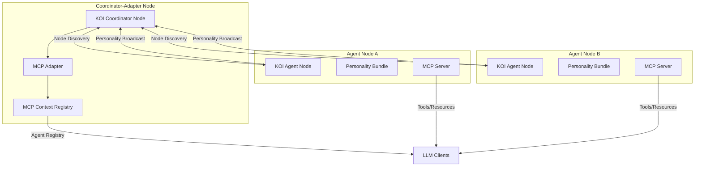

# KOI-MCP Integration

[](https://www.python.org/downloads/release/python-3120/)
[](https://fastapi.tiangolo.com/)
[](https://github.com/block-science/koi-net)

A bridging framework that integrates the Knowledge Organization Infrastructure (KOI) with the Model Context Protocol (MCP), enabling autonomous agents to exchange rich personality traits and expose capabilities as standardized tools.

## Quick Start

### Prerequisites

- Python 3.12+
- [rid-lib](https://github.com/block-science/rid-lib) (≥3.2.5)
- [koi-net](https://github.com/block-science/koi-net) (≥1.0.0b12)

### Installation

```bash
# Clone the repository
git clone https://github.com/block-science/koi-mcp-v1.git
cd koi-mcp-v1

# Create and activate virtual environment
python -m venv .venv
source .venv/bin/activate  # On Windows: .venv\Scripts\activate

# Install the package with development dependencies
pip install -e ".[dev]"
```

### Running the Demo

The quickest way to see KOI-MCP in action is to run the built-in demo:

```bash
# Run demo (starts coordinator and two example agents)
python -m koi_mcp.main demo
```

This starts a coordinator node and two agent nodes with different personality traits. You can then visit:

- Coordinator Registry: [http://localhost:9000/resources/list](http://localhost:9000/resources/list)
- Helpful Agent Tools: [http://localhost:8101/tools/list](http://localhost:8101/tools/list)
- Creative Agent Tools: [http://localhost:8102/tools/list](http://localhost:8102/tools/list)

### Running Components Individually

You can also run the components separately:

```bash
# Run coordinator node
python -m koi_mcp.main coordinator

# Run agent nodes
python -m koi_mcp.main agent --config configs/agent1.json
python -m koi_mcp.main agent --config configs/agent2.json
```

## Architecture

The KOI-MCP integration follows a **Coordinator-Adapter pattern**:



1. **KOI Coordinator Node**: Acts as a central hub for the KOI network, handling agent discovery and state synchronization
2. **MCP Adapter**: Converts KOI personality bundles into MCP-compatible resources and tools
3. **Agent Nodes**: Individual agents with personalities that broadcast their traits to the network
4. **MCP Registry Server**: Exposes the adapter's registry as MCP-compatible endpoints
5. **MCP Agent Servers**: Individual servers for each agent that expose their specific traits as endpoints

## Agent Personality Model

Agents express their capabilities through a trait-based personality model:

```python
# Example agent configuration
{
  "agent": {
    "name": "helpful-agent",
    "version": "1.0",
    "traits": {
      "mood": "helpful",
      "style": "concise",
      "interests": ["ai", "knowledge-graphs"],
      "calculate": {
        "description": "Performs simple calculations",
        "is_callable": true
      }
    }
  }
}
```

Each trait can be:

- A simple value (string, number, boolean, list)
- A complex object with metadata (description, type, is_callable)
- A callable tool that can be invoked by LLM clients

## Implementation Details

### Agent Personality RID

The system extends KOI's Resource Identifier (RID) system with a dedicated `AgentPersonality` type:

```python
class AgentPersonality(ORN):
    namespace = "agent.personality"

    def __init__(self, name, version):
        self.name = name
        self.version = version

    @property
    def reference(self):
        return f"{self.name}/{self.version}"
```

### Personality Profile Schema

Agent personalities are structured using Pydantic models:

```python
class PersonalityProfile(BaseModel):
    rid: AgentPersonality
    node_rid: KoiNetNode
    base_url: Optional[str] = None
    mcp_url: Optional[str] = None
    traits: List[PersonalityTrait] = Field(default_factory=list)
```

### Knowledge Processing Pipeline

The system integrates with KOI's knowledge processing pipeline through specialized handlers:

```python
@processor.register_handler(HandlerType.Bundle, rid_types=[AgentPersonality])
def personality_bundle_handler(proc: ProcessorInterface, kobj: KnowledgeObject):
    """Process agent personality bundles."""
    try:
        # Validate contents as PersonalityProfile
        profile = PersonalityProfile.model_validate(kobj.contents)

        # Register with MCP adapter if available
        if mcp_adapter is not None:
            mcp_adapter.register_agent(profile)

        return kobj
    except ValidationError:
        return STOP_CHAIN
```

## MCP Endpoint Integration

The integration provides MCP-compatible REST endpoints:

### Coordinator Registry Endpoints

- `GET /resources/list`: List all known agent resources
- `GET /resources/read/{resource_id}`: Get details for a specific agent
- `GET /tools/list`: List all available agent tools

### Agent Server Endpoints

- `GET /resources/list`: List this agent's personality as a resource
- `GET /resources/read/agent:{name}`: Get this agent's personality details
- `GET /tools/list`: List this agent's callable traits as tools
- `POST /tools/call/{trait_name}`: Call a specific trait as a tool

## Configuration

### Coordinator Configuration

```json
{
  "coordinator": {
    "name": "koi-mcp-coordinator",
    "base_url": "http://localhost:9000/koi-net",
    "mcp_registry_port": 9000
  }
}
```

### Agent Configuration

```json
{
  "agent": {
    "name": "helpful-agent",
    "version": "1.0",
    "base_url": "http://localhost:8100/koi-net",
    "mcp_port": 8101,
    "traits": {
      "mood": "helpful",
      "style": "concise",
      "interests": ["ai", "knowledge-graphs"],
      "calculate": {
        "description": "Performs simple calculations",
        "is_callable": true
      }
    }
  },
  "network": {
    "first_contact": "http://localhost:9000/koi-net"
  }
}
```

## Advanced Usage

### Updating Traits at Runtime

Agents can update their traits dynamically:

```python
agent = KoiAgentNode(...)
agent.update_traits({
    "mood": "enthusiastic",
    "new_capability": {
        "description": "A new capability added at runtime",
        "is_callable": True
    }
})
```

### Custom Knowledge Handlers

You can register custom handlers for personality processing:

```python
@processor.register_handler(HandlerType.Network, rid_types=[AgentPersonality])
def my_custom_network_handler(proc: ProcessorInterface, kobj: KnowledgeObject):
    # Custom logic for determining which nodes should receive personality updates
    # ...
    return kobj
```

## Development

### Running Tests

```bash
# Run all tests
pytest

# Run tests with coverage report
pytest --cov=koi_mcp
```

### Debug Mode

For enhanced debugging, use the `scripts/demo.py` script:

```bash
python scripts/demo.py
```

This provides a rich interactive console with detailed event logging and component status displays.

## Project Structure

```
koi-mcp/
├── configs/                 # Configuration files for nodes
├── docs/                    # Documentation and design specs
├── scripts/                 # Utility scripts
├── src/                     # Source code
│   └── koi_mcp/
│       ├── koi/             # KOI integration components
│       │   ├── handlers/    # Knowledge processing handlers
│       │   └── node/        # Node implementations
│       ├── personality/     # Personality models
│       │   ├── models/      # Data models for traits and profiles
│       │   └── rid.py       # Agent personality RID definition
│       ├── server/          # MCP server implementations
│       │   ├── adapter/     # KOI-to-MCP adapter
│       │   ├── agent/       # Agent server
│       │   └── registry/    # Registry server
│       ├── utils/           # Utility functions
│       ├── config.py        # Configuration handling
│       └── main.py          # Main entry point
└── tests/                   # Test suite
```

## License

This project is licensed under the MIT License - see the LICENSE file for details.

## Acknowledgments

- Built on the [KOI-Net](https://github.com/block-science/koi-net) library for distributed knowledge organization
- Compatible with the emerging [Model Context Protocol (MCP)](https://github.com/mcp-association/mcp) standard for LLM tool integration
