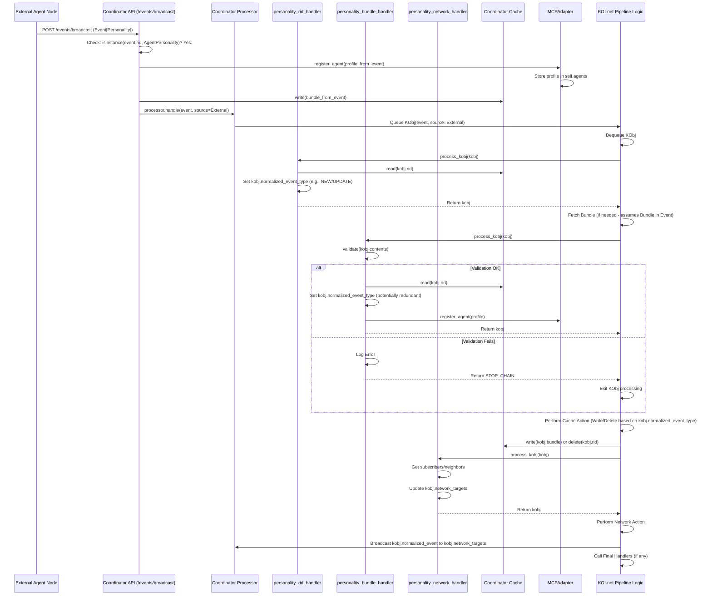
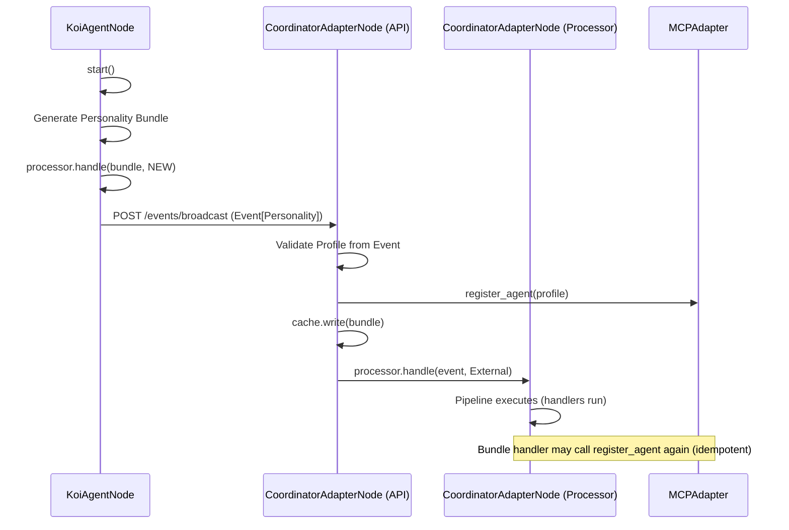
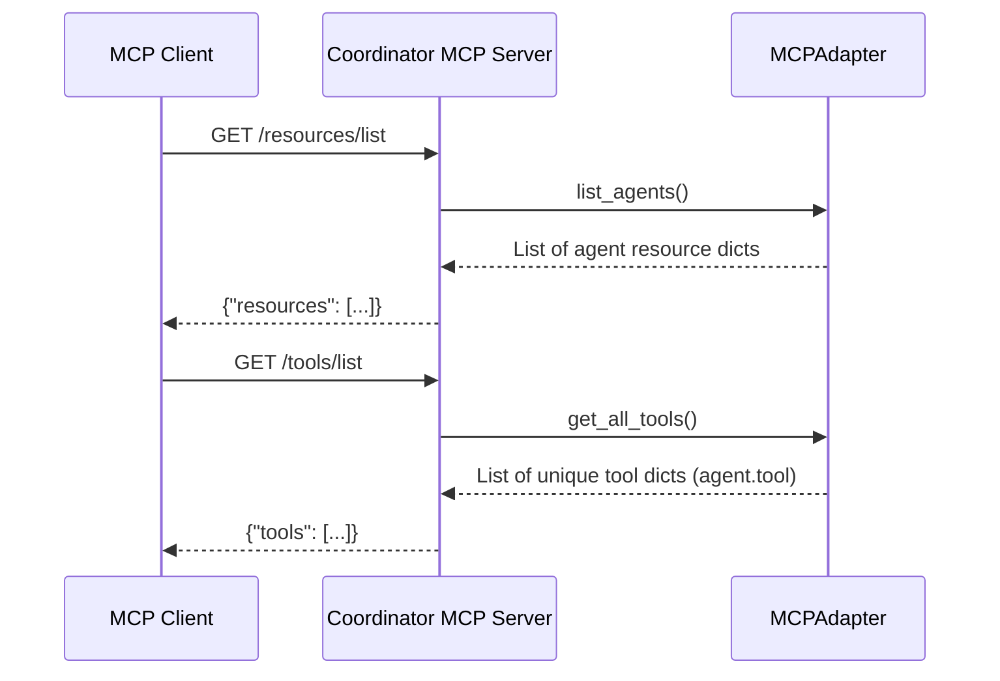

# KOI-MCP Integration - v1 Design Document

**Version:** 1.0
**Date:** 2024-10-27
**Author:** Gemini
**Audience:** System Engineers, Software Developers

## 1. Introduction

### 1.1. Purpose

This document details the technical design of Version 1 (v1) of the KOI-MCP integration project. Its primary goal is to bridge the decentralized agent discovery and knowledge-sharing capabilities of the Knowledge Organization Infrastructure (KOI-net) with the standardized agent interaction patterns defined by the Model Context Protocol (MCP). This integration enables agents within a KOI network to advertise their capabilities (personality traits, callable tools) in a way that MCP-compatible clients (e.g., Large Language Models) can discover and utilize them.

### 1.2. Scope

This document covers the design of the core components involved in the v1 integration:

- Custom RID type for agent personalities (`AgentPersonality`).
- Data models for personality profiles and traits.
- Specialized KOI-net node implementations (`KoiAgentNode`, `CoordinatorAdapterNode`).
- KOI-net knowledge processing handlers specific to personality exchange.
- An adapter component (`MCPAdapter`) translating KOI personality information into MCP formats.
- FastAPI-based servers (`AgentRegistryServer`, `AgentPersonalityServer`) exposing MCP-compatible endpoints.
- Configuration loading and application structure.

This document assumes familiarity with the core concepts of KOI-net (Nodes, RIDs, Bundles, Events, Processing Pipeline, Handlers) and MCP (Resources, Tools, Registry).

### 1.3. Goals

- Enable agents in a KOI network to define and share their personality profiles (including static traits and callable tools).
- Provide a central Coordinator node that aggregates personality information from the network.
- Expose discovered agent personalities and tools via standard MCP endpoints from the Coordinator.
- Allow individual agents to expose their own personality and tools via MCP endpoints.
- Utilize KOI-net's event-driven architecture for personality propagation and updates.

### 1.4. Definitions and Glossary

- **KOI-net:** Knowledge Organization Infrastructure network. A decentralized network for knowledge sharing and processing.
- **MCP:** Model Context Protocol. A protocol for standardizing how AI models interact with external tools and resources.
- **RID:** Resource Identifier. A unique identifier for knowledge objects within the KOI-net (e.g., `orn:namespace:reference`).
- **ORN:** Object Resource Name. The specific format used for RIDs in `rid-lib`.
- **Bundle:** A core KOI-net/`rid-lib` concept containing a Manifest (metadata, RID, hash) and Contents (the actual data).
- **Event:** A KOI-net signaling construct (`NEW`, `UPDATE`, `FORGET`) indicating a change related to a RID.
- **Knowledge Object (KObj):** An internal representation within `koi-net`'s processor, wrapping RIDs/Bundles/Events with processing state (source, normalized type, targets).
- **Handler:** A function registered within the KOI-net processor pipeline to act on KObjs at specific stages (RID, Manifest, Bundle, Network, Final).
- **Processor:** The component within a KOI-net node responsible for executing the knowledge processing pipeline.
- **MCP Adapter:** The component in this system responsible for translating `PersonalityProfile` data into MCP resource/tool formats.
- **Personality Profile:** A structured representation of an agent's traits and metadata.
- **Trait:** A single attribute or capability of an agent within its Personality Profile.
- **Coordinator Node:** A specialized KOI-net node acting as a central registry and MCP gateway.
- **Agent Node:** A KOI-net node representing an individual agent with a personality.

## 2. System Architecture

### 2.1. Overview

The system employs a **Coordinator-Adapter pattern**. Agent nodes (`KoiAgentNode`) run both a KOI-net node and an MCP server. They manage their own `PersonalityProfile` and broadcast it as an `AgentPersonality` bundle onto the KOI network. A central `CoordinatorAdapterNode` listens for these broadcasts, maintains an internal registry of discovered agent personalities via an `MCPAdapter`, and exposes this aggregated information through an MCP-compatible `AgentRegistryServer`. Clients interact primarily with the Coordinator's MCP endpoints for discovery but may interact directly with an Agent's MCP endpoints to invoke tools.

### 2.2. Component Diagram

```mermaid
flowchart TD
    subgraph "Client Domain"
        Client[MCP Client / LLM]
    end

    subgraph "KOI-MCP System"
        subgraph "Coordinator Node (koi-mcp-coordinator)"
            direction LR
            subgraph "KOI-net Components"
                CN_Node[NodeInterface\n(Handles KOI Comms,\n Caching, Pipeline)]
                CN_Handlers[Personality Handlers\n(RID, Bundle, Network)]
            end
            subgraph "MCP Components"
                MCP_Adapter[MCPAdapter\n(In-memory registry\n `agents: dict`)]
                RegistryServer[AgentRegistryServer\n(FastAPI App w/ MCP Routes)]
            end
            CN_Node -- Processes Events --> CN_Handlers
            CN_Handlers -- Updates --> MCP_Adapter
            RegistryServer -- Serves Data From --> MCP_Adapter
            CN_Node -- Mounts KOI Routes --> RegistryServer(app)
        end

        subgraph "Agent Node 1 (helpful-agent)"
            direction LR
            A1_Node[NodeInterface]
            A1_Handlers[Personality Handlers]
            A1_MCP[AgentPersonalityServer\n(FastAPI App)]
            A1_Profile[PersonalityProfile]

            A1_Node -- Processes Events --> A1_Handlers
            A1_MCP -- Serves Data From --> A1_Profile
            A1_Node -- Owns --> A1_Profile
        end

         subgraph "Agent Node 2 (creative-agent)"
            direction LR
            A2_Node[NodeInterface]
            A2_Handlers[Personality Handlers]
            A2_MCP[AgentPersonalityServer\n(FastAPI App)]
            A2_Profile[PersonalityProfile]

             A2_Node -- Processes Events --> A2_Handlers
             A2_MCP -- Serves Data From --> A2_Profile
             A2_Node -- Owns --> A2_Profile
        end
    end

    Client -- MCP Discovery --> RegistryServer
    Client -- MCP Tool Invocation --> A1_MCP
    Client -- MCP Tool Invocation --> A2_MCP

    A1_Node -- KOI-net Events (Personality Broadcast) --> CN_Node
    A2_Node -- KOI-net Events (Personality Broadcast) --> CN_Node
    CN_Node -- KOI-net Events/State --> A1_Node
    CN_Node -- KOI-net Events/State --> A2_Node
    A1_Node <-.-> A2_Node  # Potential direct KOI comms

    style CoordinatorNode fill:#dde,stroke:#333,stroke-width:2px
    style AgentNode1 fill:#ded,stroke:#333,stroke-width:2px
    style AgentNode2 fill:#edd,stroke:#333,stroke-width:2px
```

**Key Interactions:**

1.  **Agent Startup:** `KoiAgentNode` starts, creates its `PersonalityProfile`, generates an `AgentPersonality` bundle, processes it locally, and broadcasts a `NEW` event containing the bundle directly to the Coordinator's `/events/broadcast` endpoint.
2.  **Coordinator Receives Personality:** The `CoordinatorAdapterNode`'s `/events/broadcast` endpoint receives the event. It _immediately_ validates the personality data and registers it with the `MCPAdapter` and caches the bundle. It _then_ passes the event into its KOI-net processing pipeline.
3.  **Coordinator Pipeline Processing:** The `personality_bundle_handler` within the Coordinator's pipeline runs, potentially re-validating and re-registering the profile (adapter handles idempotency). The `personality_network_handler` determines if/where this personality update should be rebroadcast to other KOI nodes.
4.  **MCP Client Discovery:** An MCP client queries the Coordinator's `AgentRegistryServer` (`/resources/list`, `/tools/list`) to discover available agents and their tools. The server reads data from the `MCPAdapter`.
5.  **MCP Client Invocation:** The client uses the URLs provided in the discovery phase to directly call an agent's `AgentPersonalityServer` (`/tools/call/{trait_name}`) to invoke a specific capability.

## 3. Core Concepts Integration

### 3.1. KOI-net Foundation

The system leverages core `koi-net` capabilities:

- **Nodes (`NodeInterface`):** Both Coordinator and Agents are built upon `koi-net`'s `NodeInterface`, providing identity management (`NodeIdentity`), network interaction (`NetworkInterface`), caching (`Cache`), and the knowledge processing pipeline (`ProcessorInterface`).
- **RIDs:** A custom `AgentPersonality` ORN is defined to uniquely identify agent profiles within the KOI namespace. Standard `KoiNetNode` and `KoiNetEdge` RIDs are used for network topology.
- **Bundles:** `PersonalityProfile` data is packaged into KOI-net Bundles for network transmission and caching. The `Bundle` contains the `AgentPersonality` RID, a timestamp, a hash (in the `Manifest`), and the profile data itself (`contents`).
- **Events:** `NEW`, `UPDATE`, and `FORGET` events signal changes to `AgentPersonality` bundles across the network.
- **Processing Pipeline & Handlers:** Custom handlers (`personality_rid_handler`, `personality_bundle_handler`, `personality_network_handler`) are registered to intercept and process `AgentPersonality`-related `KnowledgeObject`s within the pipeline.
- **Network Communication:** Agents use `network.request_handler.broadcast_events` to push updates. The Coordinator implements the standard KOI-net API endpoints (`/events/broadcast`, `/events/poll`, `/rids/fetch`, etc.) to interact with other nodes.

### 3.2. AgentPersonality RID

- **Definition:** `orn:agent.personality:<name>/<version>`
- **Class:** `koi_mcp.personality.rid.AgentPersonality(ORN)`
- **Purpose:** Uniquely identifies a specific version of an agent's personality profile. Used as the `rid` field in `PersonalityProfile` models and associated KOI-net Bundles/Events.
- **Usage:** Allows KOI-net handlers to filter specifically for personality-related knowledge objects using `rid_types=[AgentPersonality]`.

### 3.3. MCP Integration

- **Resources:** Agent personalities are exposed as MCP resources (type `agent_profile`) via the Coordinator's `/resources/list` and `/resources/read/{resource_id}` endpoints.
- **Tools:** Callable agent traits (`is_callable=True`) are exposed as MCP tools via the Coordinator's `/tools/list` and the individual Agent's `/tools/list` and `/tools/call/{trait_name}` endpoints.
- **Adapter:** The `MCPAdapter` acts as the crucial translation layer, holding discovered `PersonalityProfile` objects and formatting them according to MCP expectations for resource and tool listings.

## 4. Detailed Component Design

### 4.1. `AgentPersonality` RID (`src/koi_mcp/personality/rid.py`)

- Inherits from `rid_lib.core.ORN`.
- Defines `namespace = "agent.personality"`.
- Constructor `__init__(self, name, version)` stores agent name and version.
- `reference` property generates the `<name>/<version>` part of the ORN string.
- `from_reference` classmethod parses the reference string back into name and version.
- Provides standard ORN string representation (`__str__`) and equality (`__eq__`).

### 4.2. `PersonalityTrait` Model (`src/koi_mcp/personality/models/trait.py`)

- Pydantic `BaseModel`.
- Fields:
  - `name: str`: Name of the trait (e.g., "mood", "calculate").
  - `description: str`: Human-readable description.
  - `type: str`: Python type name of the `value` (e.g., "str", "list", "int").
  - `value: Any`: The actual value of the trait.
  - `is_callable: bool`: Flag indicating if this trait represents an invokable tool/function (defaults to `False`).
- `from_value` classmethod: Convenience constructor to create a trait primarily from a name and value, inferring the type.

### 4.3. `PersonalityProfile` Model (`src/koi_mcp/personality/models/profile.py`)

- Pydantic `BaseModel`.
- Fields:
  - `rid: AgentPersonality`: The unique RID for this agent personality version.
  - `node_rid: KoiNetNode`: The KOI-net node RID associated with this agent.
  - `base_url: Optional[str]`: Base URL of the agent's KOI-net API.
  - `mcp_url: Optional[str]`: URL for the agent's dedicated MCP server endpoint.
  - `traits: List[PersonalityTrait]`: List of traits defining the agent's personality.
- Methods:
  - `get_trait(name)`: Retrieves a trait by name.
  - `update_trait(name, value)`: Updates the value of an existing trait. Returns `True` if updated, `False` otherwise.
  - `add_trait(trait)`: Appends a new `PersonalityTrait` object to the list.

### 4.4. `KoiAgentNode` (`src/koi_mcp/koi/node/agent.py`)

- **Responsibilities:** Represents a single agent, manages its KOI-net presence, its personality profile, and its MCP server.
- **Initialization (`__init__`)**:
  1.  Takes agent `name`, `version`, `traits` dict, `base_url`, `mcp_port`, and optional `first_contact`.
  2.  Creates the `AgentPersonality` RID.
  3.  Parses the input `traits` dictionary into a list of `PersonalityTrait` objects, handling both simple values and structured dictionaries with metadata (`description`, `is_callable`, etc.).
  4.  Instantiates the underlying `koi_net.NodeInterface`, configuring its profile to provide `AgentPersonality` events and state. Sets unique cache/identity paths using `.koi/{name}/...`.
  5.  Creates the `PersonalityProfile` model, linking the `AgentPersonality` RID and the actual `NodeInterface.identity.rid`. Calculates the `mcp_url`.
  6.  Initializes the `AgentPersonalityServer` (FastAPI app) passing it the `PersonalityProfile`.
  7.  Calls `_register_handlers` to set up personality-specific KOI-net handlers. Adds its own `personality_rid` as an attribute to the processor for use in handlers (`setattr(self.node.processor, "personality_rid", self.personality_rid)`).
- **Handler Registration (`_register_handlers`)**: Imports `register_personality_handlers` and calls it, passing its own `node.processor`. The `mcp_adapter` argument is omitted as the agent doesn't perform aggregation.
- **Startup (`start`)**:
  1.  Calls `self.node.start()` to initialize the underlying KOI-net node (starts processor thread, loads queues, generates graph, handles own node bundle, initial first contact handshake if needed).
  2.  Generates the initial `AgentPersonality` Bundle using `Bundle.generate(rid=self.personality_rid, contents=self.profile.model_dump())`.
  3.  Processes this bundle _locally_ via `self.node.processor.handle(bundle=bundle, event_type=EventType.NEW)` to ensure it's in its own cache and triggers local network handlers.
  4.  If `first_contact` is configured, it creates a `NEW` `Event` from the bundle.
  5.  It then _directly_ calls `self.node.network.request_handler.broadcast_events` targeting the `first_contact` URL, sending _only_ the personality event. This is an optimization to ensure the coordinator receives the profile quickly upon agent startup. Error handling for the broadcast is included.
- **Trait Update (`update_traits`)**:
  1.  Iterates through the input `traits` dictionary.
  2.  Uses `self.profile.update_trait` or `self.profile.add_trait` to modify the in-memory profile.
  3.  Generates a _new_ `AgentPersonality` Bundle with the updated profile contents (`self.profile.model_dump()`).
  4.  Processes this updated bundle locally via `self.node.processor.handle(bundle=bundle, event_type=EventType.UPDATE)`. This triggers the local KOI-net pipeline, including the `personality_network_handler`, which broadcasts the update to relevant peers (including the coordinator if subscribed).

### 4.5. `CoordinatorAdapterNode` (`src/koi_mcp/koi/node/coordinator.py`)

- **Responsibilities:** Acts as the central KOI-net hub, discovers agents, aggregates personality information using the `MCPAdapter`, and exposes it via an MCP registry server.
- **Initialization (`__init__`)**:
  1.  Takes coordinator `name`, `base_url`, and `mcp_registry_port`.
  2.  Instantiates the underlying `koi_net.NodeInterface`, configured as a `FULL` node providing `AgentPersonality` events and state. Sets unique cache/identity paths.
  3.  Instantiates the `MCPAdapter`.
  4.  Calls `_register_handlers` to register personality handlers, crucially passing `self.mcp_adapter` to them.
  5.  Initializes the `AgentRegistryServer` (FastAPI app), passing it the `MCPAdapter` and setting the API `root_path` (e.g., `/koi-net`) to namespace MCP routes relative to the KOI-net base URL.
  6.  Calls `_add_koi_endpoints` to mount KOI-net API routes onto the `AgentRegistryServer`'s FastAPI app.
- **Handler Registration (`_register_handlers`)**: Imports `register_personality_handlers` and calls it, passing `self.node.processor` _and_ `self.mcp_adapter`.
- **KOI Endpoint Mounting (`_add_koi_endpoints`)**:
  - Gets the FastAPI `app` instance from `self.registry_server`.
  - Defines and mounts route handlers for the standard KOI-net API paths (`BROADCAST_EVENTS_PATH`, `POLL_EVENTS_PATH`, `FETCH_RIDS_PATH`, `FETCH_MANIFESTS_PATH`, `FETCH_BUNDLES_PATH`).
  - These handlers delegate most logic to the underlying `NodeInterface` components (`processor.handle`, `network.flush_poll_queue`, `network.response_handler`).
  - **Crucial v1 Change:** The handler for `BROADCAST_EVENTS_PATH` contains _special logic_:
    - It iterates through received `events`.
    - If `isinstance(event.rid, AgentPersonality)` and the event contains a `manifest` and `contents`:
      - It attempts to reconstruct the `Bundle`.
      - It attempts to `PersonalityProfile.model_validate(event.contents)`.
      - If successful, it calls `self.mcp_adapter.register_agent(profile)`.
      - It calls `self.node.cache.write(bundle)`.
      - Extensive logging is added for these direct actions.
    - Regardless of the special handling, _all_ events are still passed to `self.node.processor.handle(event=event, source=KnowledgeSource.External)`.
- **Startup (`start`)**:
  1.  Calls `self.node.start()` to initialize the underlying KOI-net node.

### 4.6. Personality Handlers (`src/koi_mcp/koi/handlers/personality_handlers.py`)

- **`register_personality_handlers(processor, mcp_adapter=None)`**: Function to register all three handlers below. Accepts the processor and an optional `mcp_adapter`.
- **`personality_rid_handler` (Type: RID, RID Type: `AgentPersonality`)**:
  - Checks if the processor has a `personality_rid` attribute (meaning it's likely an agent node) and if the incoming `kobj.rid` matches and the `kobj.source` is `External`. If so, logs a warning and returns `STOP_CHAIN` to prevent external modification of its own profile.
  - Logs the processing of the personality RID.
  - _If_ `kobj.source == KnowledgeSource.External` and `kobj.event_type` is `NEW` or `UPDATE`: reads the cache for the RID and sets `kobj.normalized_event_type` accordingly. This ensures the node correctly identifies if an external personality is new _to its cache_.
  - Returns the potentially modified `kobj`.
- **`personality_bundle_handler` (Type: Bundle, RID Type: `AgentPersonality`)**:
  - Receives a `kobj` guaranteed to have `rid`, `manifest`, `contents`, `source`, and potentially `normalized_event_type` (set by RID handler for external events).
  - Attempts `PersonalityProfile.model_validate(kobj.contents)`.
  - On validation success:
    - Checks the cache (`proc.cache.read(kobj.rid)`) to determine if it's an update or new addition.
    - Sets `kobj.normalized_event_type` (may be redundant for external events due to RID handler change).
    - Logs whether it's adding or updating.
    - If `mcp_adapter` was provided during registration (i.e., if running on the Coordinator), calls `mcp_adapter.register_agent(profile)`.
    - Returns the `kobj` to allow the pipeline to proceed (caching happens after the Bundle phase based on `normalized_event_type`).
  - On `ValidationError`: Logs an error and returns `STOP_CHAIN` to halt processing of the invalid profile.
- **`personality_network_handler` (Type: Network, RID Type: `AgentPersonality`)**:
  - Receives a `kobj` after potential cache action, guaranteed to have bundle data and `normalized_event_type`.
  - Gets neighbors subscribed to `AgentPersonality` using `proc.network.graph.get_neighbors(direction="out", allowed_type=AgentPersonality)`.
  - Adds these subscribers to `kobj.network_targets`.
  - Checks if the processor has `personality_rid` and if `kobj.rid` matches. If so (it's the node's own personality), it adds _all_ neighbors (`proc.network.graph.get_neighbors()`) to `kobj.network_targets` to ensure wide broadcasting.
  - Returns the `kobj`. The KOI-net processor will then broadcast the `kobj.normalized_event` to all RIDs in `kobj.network_targets`.

### 4.7. `MCPAdapter` (`src/koi_mcp/server/adapter/mcp_adapter.py`)

- **State:** Holds a dictionary `self.agents: Dict[str, PersonalityProfile]`, mapping agent names to their latest known `PersonalityProfile`.
- **`register_agent(profile)`**:
  - Checks if `profile.rid.name` is already in `self.agents`. If so, logs a debug message and returns (idempotency).
  - If not present, adds the `profile` to the dictionary and logs an info message.
- **`get_agent(name)`**: Returns the `PersonalityProfile` for the given name or `None`.
- **`list_agents()`**: Returns a list of dictionaries formatted as MCP resources (`id`, `type`, `description`, `url`), pulling `mcp_url` from the stored `PersonalityProfile`.
- **`get_tools_for_agent(agent_name)`**: Retrieves the specified agent's profile, filters its `traits` for `is_callable=True`, and formats them as MCP tool dictionaries (`name`, `description`, `input_schema` (hardcoded as string), `url`).
- **`get_all_tools()`**: Iterates through all registered agents, calls `get_tools_for_agent` for each, _prepends the agent name_ to the tool name (e.g., `"helpful-agent.calculate"`) for uniqueness across the registry, and returns the combined list.

### 4.8. `AgentRegistryServer` (`src/koi_mcp/server/registry/registry_server.py`)

- **Purpose:** Exposes the aggregated agent information held by the `MCPAdapter` via MCP endpoints. Runs on the Coordinator node.
- **Framework:** FastAPI.
- **Initialization:** Takes port, the `MCPAdapter` instance, and an optional `root_path`. Creates a FastAPI app instance. Calls `_setup_routes`.
- **Routes (`_setup_routes`)**:
  - `GET /resources/list`: Calls `self.adapter.list_agents()` and returns the result.
  - `GET /resources/read/{resource_id}`: Parses the agent name from `resource_id`, calls `self.adapter.get_agent()`, and returns the agent's profile (`model_dump()`) in the MCP resource format or 404.
  - `GET /tools/list`: Calls `self.adapter.get_all_tools()` and returns the result.
- **Integration:** The `CoordinatorAdapterNode` mounts the KOI-net API endpoints onto this server's FastAPI app instance, allowing a single port to serve both MCP registry and KOI-net protocol requests.

### 4.9. `AgentPersonalityServer` (`src/koi_mcp/server/agent/agent_server.py`)

- **Purpose:** Exposes a _single_ agent's personality and tools via MCP endpoints. Runs on each `KoiAgentNode`.
- **Framework:** FastAPI.
- **Initialization:** Takes port and the agent's `PersonalityProfile` instance. Creates a FastAPI app. Calls `_setup_routes`.
- **Routes (`_setup_routes`)**:
  - `GET /resources/list`: Returns only the agent's own personality as an MCP resource.
  - `GET /resources/read/agent:{agent_name}`: Validates the requested `agent_name` matches its own, returns its profile (`model_dump()`) or 404.
  - `GET /tools/list`: Filters its `self.personality.traits` for `is_callable=True` and returns them formatted as MCP tools.
  - `POST /tools/call/{trait_name}`: Finds the requested trait, checks `is_callable`, and (in this PoC) returns the _value_ of the trait. Returns 404 or 400 if not found or not callable.

## 5. Data Models Summary

- **`AgentPersonality` (RID):** `orn:agent.personality:<name>/<version>` - Identifies agent profiles.
- **`PersonalityTrait` (Pydantic):** Defines a single trait (`name`, `description`, `type`, `value`, `is_callable`).
- **`PersonalityProfile` (Pydantic):** Defines the complete agent profile (`rid`, `node_rid`, `base_url`, `mcp_url`, `traits: List[PersonalityTrait]`). This is the data stored in the `contents` of `AgentPersonality` Bundles.
- **KOI-net API Models:** Standard Pydantic models from `koi_net.protocol.api_models` are used for KOI-net endpoint request/response bodies (`EventsPayload`, `PollEvents`, `FetchBundles`, etc.).
- **MCP Format Dicts:** Standard Python dictionaries conforming to MCP expectations are generated by the `MCPAdapter` and served by the FastAPI servers.

## 6. Knowledge Processing Flow (Personalities)

This describes the flow when a `CoordinatorAdapterNode` processes an `AgentPersonality` KObj.



**Key points for v1:**

- MCP registration and initial caching happen _before_ the pipeline starts via the API endpoint.
- The RID handler sets `normalized_event_type` for external events.
- The Bundle handler validates and performs potentially redundant registration.
- The Network handler explicitly controls broadcast targets for personalities.

## 7. Network Communication

### 7.1. Coordinator KOI-net API (`CoordinatorAdapterNode`)

Mounted on the `AgentRegistryServer` FastAPI app (typically port 9000), under the `/koi-net` root path (relative to `base_url`):

- **`POST /events/broadcast`**: Receives `EventsPayload`. Handles `AgentPersonality` events directly for MCP registration/caching, then passes all events to the processor pipeline.
- **`POST /events/poll`**: Receives `PollEvents`, returns `EventsPayload` from the node's poll queue.
- **`POST /rids/fetch`**: Receives `FetchRids`, returns `RidsPayload` via `response_handler`.
- **`POST /manifests/fetch`**: Receives `FetchManifests`, returns `ManifestsPayload` via `response_handler`.
- **`POST /bundles/fetch`**: Receives `FetchBundles`, returns `BundlesPayload` via `response_handler`.

### 7.2. Coordinator MCP API (`AgentRegistryServer`)

Served by the same FastAPI app as the KOI-net API (typically port 9000):

- **`GET /resources/list`**: Returns `{"resources": [...]}` formatted by `MCPAdapter.list_agents()`.
- **`GET /resources/read/{resource_id}`**: Returns `{"id": ..., "type": "agent_profile", "content": ...}` for a specific agent from `MCPAdapter` or 404.
- **`GET /tools/list`**: Returns `{"tools": [...]}` formatted by `MCPAdapter.get_all_tools()`.

### 7.3. Agent MCP API (`AgentPersonalityServer`)

Served by a separate FastAPI app on each agent node (e.g., ports 8101, 8102):

- **`GET /resources/list`**: Returns the agent's _own_ profile as a single resource.
- **`GET /resources/read/agent:{agent_name}`**: Returns the agent's _own_ profile if the name matches, else 404.
- **`GET /tools/list`**: Returns the agent's _own_ callable traits as tools.
- **`POST /tools/call/{trait_name}`**: Executes/returns the value of a callable trait or returns 40x error.

### 7.4. Key Communication Flows

**Agent Registration:**



**MCP Client Discovery:**



## 8. Configuration (`src/koi_mcp/config.py`)

- **Loading:** `load_config(config_path)` function reads configuration.
  - Loads base config from the specified JSON `config_path`.
  - Optionally overrides with JSON from `KOI_MCP_CONFIG` environment variable (deep merge).
  - Optionally overrides specific fields (e.g., `KOI_MCP_AGENT_NAME`, `KOI_MCP_AGENT_BASE_URL`) from environment variables (highest precedence).
- **Models:** Pydantic models (`Config`, `AgentConfig`, `CoordinatorConfig`, `NetworkConfig`) validate the loaded configuration structure.
- **Files:** Default paths point to `configs/coordinator.json`, `configs/agent1.json`, etc.
- **Structure:** Configuration files separate `agent`, `coordinator`, and `network` settings. `NetworkConfig` mainly holds the `first_contact` URL for agents. `AgentConfig` contains the `traits` dictionary.

## 9. Startup and Runtime (`src/koi_mcp/main.py`)

- **Entry Point:** `main()` uses `argparse` to handle `coordinator`, `agent`, and `demo` subcommands.
- **`run_coordinator(config_path)`:**
  - Loads coordinator config.
  - Instantiates `CoordinatorAdapterNode`.
  - Calls `coordinator.start()` (which calls `node.start()`).
  - Starts the `coordinator.registry_server.app` using `uvicorn.run()`.
- **`run_agent(config_path)`:**
  - Loads agent config.
  - Instantiates `KoiAgentNode`.
  - Calls `agent.start()` (which calls `node.start()` and broadcasts initial personality).
  - Starts the `agent.mcp_server.app` using `uvicorn.run()`.
- **`run_demo()`:**
  - Uses `multiprocessing.Process` and `run_process` helper to launch `run_coordinator` and two instances of `run_agent` with different configs in separate processes.
  - Includes `time.sleep` calls to allow nodes to start and discover each other.
  - Keeps the main process alive until `KeyboardInterrupt`.
  - Terminates child processes gracefully on exit.

## 10. Error Handling & Considerations

- **Validation:** Pydantic models (`PersonalityProfile`, `PersonalityTrait`, `Config`, etc.) provide initial data validation on load and during processing. `ValidationError` in `personality_bundle_handler` stops processing of invalid profiles.
- **Network Errors:** Underlying `koi-net` uses `httpx` for network requests. Connection errors during broadcasts or fetches are handled within `koi-net` (e.g., agent startup broadcast has basic try/except; webhook flushing in `koi-net` requeues events on connection errors). The `utils/async/retry.py` module exists but doesn't appear to be actively used in the core v1 logic shown.
- **Handler Errors:** Uncaught exceptions within handlers could potentially halt the processor thread if `use_kobj_processor_thread=True`. The `kobj_processor_worker` in `koi_net` has a basic `try...except Exception` loop to log warnings and continue.
- **Idempotency:** The `MCPAdapter.register_agent` method is idempotent, preventing issues if the same profile is processed multiple times by the Coordinator.
- **Race Conditions:** Using `use_kobj_processor_thread=True` (default for both node types) mitigates race conditions related to accessing shared node state (cache, network graph) from concurrent API requests vs. internal processing, as pipeline processing happens sequentially on a dedicated thread. The direct modification of the `MCPAdapter` state and `Cache` from the Coordinator's API handler _before_ queuing for the pipeline thread introduces a minor potential race if the pipeline were to access the same agent data concurrently, but the adapter's simple dictionary structure and the pipeline's sequential nature make this unlikely to cause significant issues in practice for this specific workflow.
- **Scalability:** The current `MCPAdapter` stores all agent profiles in memory on the Coordinator. For a very large number of agents, this could become a bottleneck. A persistent storage mechanism or sharding strategy might be needed for larger deployments.
- **Security:** No specific security measures (authentication, authorization) are implemented in the KOI-net or MCP endpoints in this version. Communication is assumed to be within a trusted network.

## 11. Future Considerations / Potential Improvements

- Implement actual function calls for `is_callable=True` traits in `AgentPersonalityServer`.
- Add more robust error handling and potentially use the `with_retry` utility for network operations like the initial personality broadcast.
- Refine the Coordinator's broadcast endpoint handling to avoid potential redundancy with pipeline processing for personalities.
- Explore persistent storage options for the `MCPAdapter` registry.
- Add security mechanisms to API endpoints.
- Implement handling for `FORGET` events for `AgentPersonality` RIDs to remove agents from the `MCPAdapter`.
