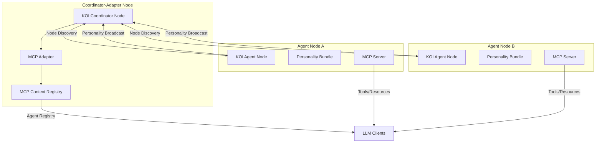

# KOI–MCP Integration

A lightweight bridge that lets autonomous KOI network **agent nodes** exchange richly‑typed _personality_ objects and surface them as live **MCP resources & tools**.

The result: agents discover each other, share traits, and expose those traits to any LLM‑aware client without bespoke glue code.

## Key Concepts

| Concept                              | Purpose                                                                     |
| ------------------------------------ | --------------------------------------------------------------------------- |
| **KOI Network**                      | P2P knowledge‑object bus (events, state, cache)                             |
| **AgentPersonality RID**             | Globally unique identifier (`orn:agent.personality:<name>/<v>`), versioned  |
| **KoiAgentNode**                     | Full KOI node with built‑in personality publishing & discovery              |
| **AgentPersonalityServer (FastAPI)** | Minimal MCP server that turns personalities into resources & callable tools |
| **MCPAdapter**                       | Synchronises KOI personalities → MCP context (one line API)                 |

## Architecture

This integration uses a Coordinator-Adapter pattern where a central Coordinator Node acts as both KOI network hub and MCP registry.

## Implementation

The implementation includes:

1. **KOI Extensions**:
   - Custom AgentPersonality RID
   - Personality schema and validation
   - KOI knowledge handlers

2. **MCP Components**:
   - Registry server exposing all agents
   - Agent servers exposing individual traits
   - Adapter converting KOI bundles to MCP resources

3. **Coordinator & Agent Nodes**:
   - Coordinator: Central discovery node with MCP registry
   - Agent: Trait-publishing node with MCP trait server

## License

MIT
