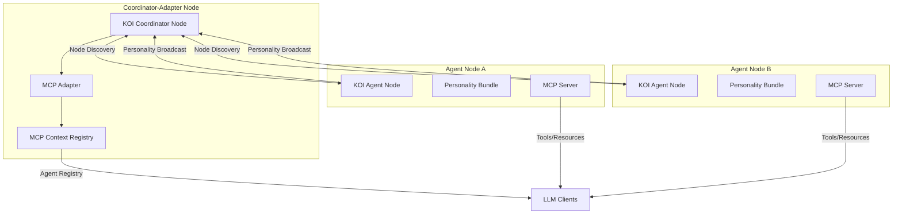
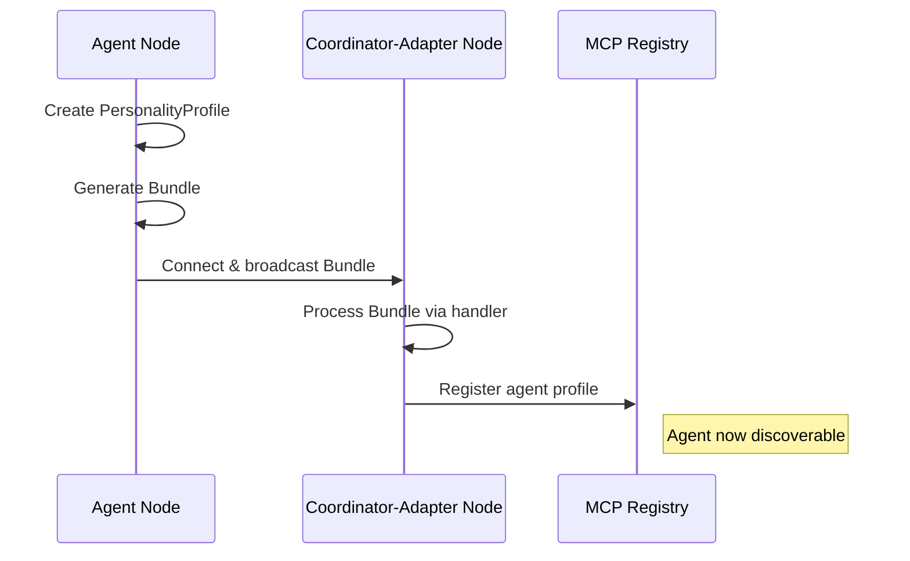
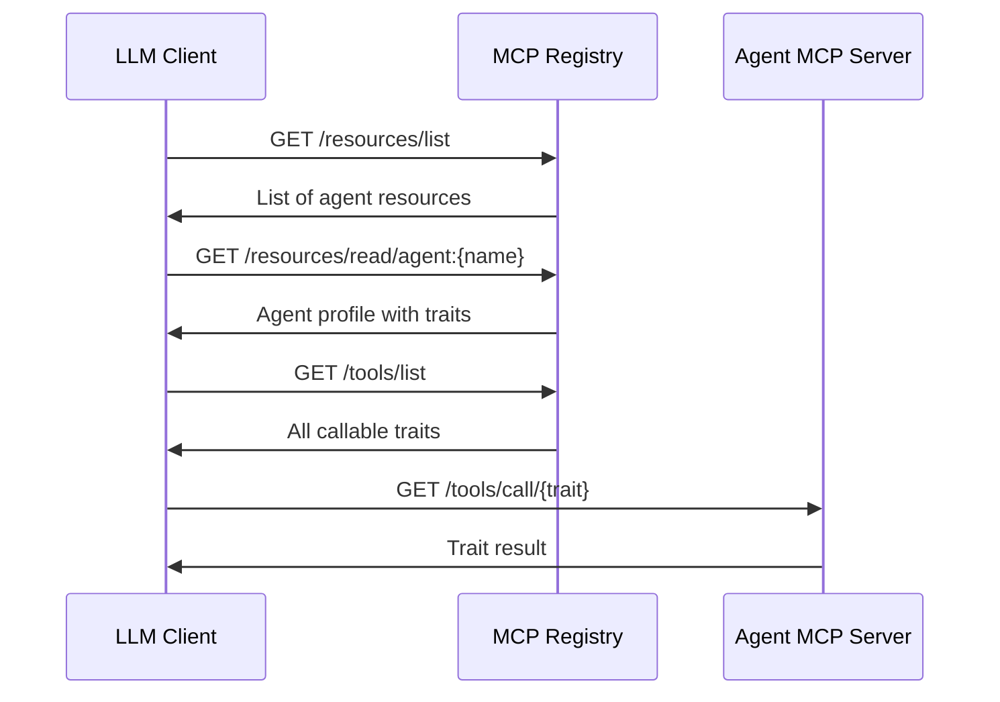

# KOI-MCP Integration Specification

## Core Integration for Proof of Concept

### 1. Overview

This specification describes a Proof of Concept (POC) integration between the Knowledge Organization Infrastructure (KOI) network and the Model Context Protocol (MCP). The core innovation is using a Coordinator-Adapter pattern where an integrated Coordinator Node orchestrates agent discovery and trait exchange across the network.

### 2. Architecture

The architecture employs a Coordinator Node as the central orchestration point for agent discovery and personality exchange.



### 3. Key Components

#### 3.1 Coordinator-Adapter Node

A specialized KOI node that integrates coordination functions with MCP adaptation:

```python
class CoordinatorAdapterNode:
    def __init__(self,
                 name: str,
                 base_url: str,
                 mcp_registry_port: int = 9000):
        # Initialize KOI Coordinator Node
        self.node = NodeInterface(
            name=name,
            profile=NodeProfile(
                base_url=base_url,
                node_type=NodeType.FULL,
                provides=NodeProvides(
                    event=[KoiNetNode, KoiNetEdge, AgentPersonality],
                    state=[KoiNetNode, KoiNetEdge, AgentPersonality]
                )
            ),
            use_kobj_processor_thread=True
        )

        # Initialize MCP Adapter with Registry
        self.mcp_adapter = MCPAdapter()
        self.agent_registry = {}

        # Register handlers
        self._register_handlers()

        # Initialize MCP Registry Server
        self.registry_server = AgentRegistryServer(
            port=mcp_registry_port,
            adapter=self.mcp_adapter
        )
```

#### 3.2 Agent Personality RID

Extend the KOI-net RID types with a dedicated AgentPersonality type:

```python
class AgentPersonality(ORN):
    namespace = "agent.personality"

    def __init__(self, name, version):
        self.name = name
        self.version = version

    @property
    def reference(self):
        return f"{self.name}/{self.version}"

    @classmethod
    def from_reference(cls, reference):
        components = reference.split("/")
        if len(components) == 2:
            return cls(*components)
        else:
            raise ValueError(
                "Agent Personality reference must contain: '<name>/<version>'"
            )
```

#### 3.3 Personality Profile Schema

Define a standardized schema for agent personalities:

```python
class PersonalityTrait(BaseModel):
    name: str
    description: str
    type: str
    value: Any
    is_callable: bool = False

class PersonalityProfile(BaseModel):
    rid: AgentPersonality
    node_rid: KoiNetNode
    base_url: str | None = None
    mcp_url: str | None = None
    traits: list[PersonalityTrait]
```

#### 3.4 MCP Adapter

Bridge KOI personalities to MCP context:

```python
class MCPAdapter:
    def __init__(self):
        self.agents = {}  # name -> PersonalityProfile

    def register_agent(self, profile: PersonalityProfile):
        """Register an agent profile with the adapter."""
        self.agents[profile.rid.name] = profile

    def get_agent(self, name: str) -> PersonalityProfile | None:
        """Retrieve an agent profile by name."""
        return self.agents.get(name)

    def list_agents(self) -> list[dict]:
        """Get list of all known agents as MCP resources."""
        return [
            {
                "id": f"agent:{agent.rid.name}",
                "type": "agent_profile",
                "description": f"Agent {agent.rid.name} personality profile",
                "url": agent.mcp_url
            }
            for agent in self.agents.values()
        ]

    def get_tools_for_agent(self, agent_name: str) -> list[dict]:
        """Get list of tools provided by a specific agent."""
        agent = self.get_agent(agent_name)
        if not agent:
            return []

        return [
            {
                "name": trait.name,
                "description": trait.description,
                "url": f"{agent.mcp_url}/tools/call/{trait.name}"
            }
            for trait in agent.traits
            if trait.is_callable
        ]
```

#### 3.5 Registry Server

MCP-compatible server that exposes agent registry:

```python
class AgentRegistryServer:
    def __init__(self, port: int, adapter: MCPAdapter):
        self.port = port
        self.adapter = adapter
        self.app = FastAPI()

        # Set up routes
        self._setup_routes()

    def _setup_routes(self):
        @self.app.get("/resources/list")
        def list_resources():
            return {"resources": self.adapter.list_agents()}

        @self.app.get("/resources/read/{resource_id}")
        def read_resource(resource_id: str):
            if not resource_id.startswith("agent:"):
                raise HTTPException(status_code=404, detail="Resource not found")

            agent_name = resource_id[6:]  # Strip "agent:" prefix
            agent = self.adapter.get_agent(agent_name)

            if not agent:
                raise HTTPException(status_code=404, detail="Agent not found")

            return {
                "id": resource_id,
                "type": "agent_profile",
                "content": agent.model_dump()
            }

        @self.app.get("/tools/list")
        def list_tools():
            all_tools = []
            for agent_name in self.adapter.agents.keys():
                all_tools.extend(self.adapter.get_tools_for_agent(agent_name))

            return {"tools": all_tools}
```

#### 3.6 Agent Node

Extended KOI node with personality support:

```python
class KoiAgentNode:
    def __init__(self,
                 name: str,
                 version: str,
                 traits: dict,
                 base_url: str,
                 mcp_port: int,
                 first_contact: str | None = None):

        # Create personality RID
        self.personality_rid = AgentPersonality(name, version)

        # Convert traits dict to PersonalityTraits
        self.traits = [
            PersonalityTrait(
                name=key,
                description=f"{key} trait for {name}",
                type=type(value).__name__,
                value=value,
                is_callable=callable(value) if hasattr(value, "__call__") else False
            )
            for key, value in traits.items()
        ]

        # Create personality profile
        self.profile = PersonalityProfile(
            rid=self.personality_rid,
            node_rid=None,  # Will be set after node creation
            base_url=base_url,
            mcp_url=f"{base_url.rstrip('/')}/mcp",
            traits=self.traits
        )

        # Initialize KOI node
        self.node = NodeInterface(
            name=name,
            profile=NodeProfile(
                base_url=base_url,
                node_type=NodeType.FULL,
                provides=NodeProvides(
                    event=[AgentPersonality],
                    state=[AgentPersonality]
                )
            ),
            use_kobj_processor_thread=True,
            first_contact=first_contact
        )

        # Update profile with node RID
        self.profile.node_rid = self.node.identity.rid

        # Initialize MCP server
        self.mcp_server = AgentPersonalityServer(
            port=mcp_port,
            personality=self.profile
        )

        # Register handlers
        self._register_handlers()

    def update_traits(self, traits: dict):
        """Update agent's traits and broadcast changes."""
        # Update traits
        for key, value in traits.items():
            for trait in self.traits:
                if trait.name == key:
                    trait.value = value
                    break
            else:
                self.traits.append(PersonalityTrait(
                    name=key,
                    description=f"{key} trait for {self.profile.rid.name}",
                    type=type(value).__name__,
                    value=value
                ))

        # Create updated bundle
        bundle = Bundle.generate(
            rid=self.personality_rid,
            contents=self.profile.model_dump()
        )

        # Process bundle internally to broadcast to network
        self.node.processor.handle(bundle=bundle, event_type=EventType.UPDATE)
```

### 4. Knowledge Processing Handlers

#### 4.1 Personality RID Handler

```python
@node.processor.register_handler(HandlerType.RID, rid_types=[AgentPersonality])
def personality_rid_handler(processor: ProcessorInterface, kobj: KnowledgeObject):
    """Validate agent personality RIDs."""
    # Block external sources from modifying our own personality
    if (kobj.rid.name == processor.identity.profile.name and
        kobj.source == KnowledgeSource.External):
        logger.warning(f"Blocked external update to our personality: {kobj.rid}")
        return STOP_CHAIN
    return kobj
```

#### 4.2 Personality Bundle Handler

```python
@node.processor.register_handler(HandlerType.Bundle, rid_types=[AgentPersonality])
def personality_bundle_handler(processor: ProcessorInterface, kobj: KnowledgeObject):
    """Process agent personality bundles."""
    try:
        # Validate contents as PersonalityProfile
        profile = PersonalityProfile.model_validate(kobj.contents)

        # Set normalized event type based on cache status
        prev_bundle = processor.cache.read(kobj.rid)
        if prev_bundle:
            kobj.normalized_event_type = EventType.UPDATE
        else:
            kobj.normalized_event_type = EventType.NEW

        # Register with MCP adapter if we're the coordinator
        if hasattr(processor, "mcp_adapter"):
            processor.mcp_adapter.register_agent(profile)

        return kobj

    except ValidationError:
        logger.error(f"Invalid personality profile format: {kobj.rid}")
        return STOP_CHAIN
```

#### 4.3 Personality Network Handler

```python
@node.processor.register_handler(HandlerType.Network, rid_types=[AgentPersonality])
def personality_network_handler(processor: ProcessorInterface, kobj: KnowledgeObject):
    """Determine which nodes to broadcast personality updates to."""
    # Get all neighbors interested in AgentPersonality
    subscribers = processor.network.graph.get_neighbors(
        direction="out",
        allowed_type=AgentPersonality
    )

    # Add all subscribers as network targets
    kobj.network_targets.update(subscribers)

    # If this is our personality, always broadcast
    if (hasattr(processor, "personality_rid") and
        kobj.rid == processor.personality_rid):
        kobj.network_targets.update(processor.network.graph.get_neighbors())

    return kobj
```

### 5. Implementation Flow

#### 5.1 Agent Registration Flow



#### 5.2 Trait Discovery Flow



### 6. Configuration

Standard configuration for the Coordinator-Adapter node:

```json
{
  "coordinator": {
    "name": "koi-mcp-coordinator",
    "base_url": "http://localhost:8000/koi-net",
    "mcp_registry_port": 9000
  }
}
```

Standard configuration for Agent nodes:

```json
{
  "agent": {
    "name": "example-agent",
    "version": "1.0",
    "base_url": "http://localhost:8100/koi-net",
    "mcp_port": 8101,
    "traits": {
      "mood": "helpful",
      "style": "concise",
      "interests": ["ai", "knowledge-graphs"],
      "calculate": {
        "description": "Performs simple calculations",
        "is_callable": true
      }
    }
  },
  "network": {
    "first_contact": "http://localhost:8000/koi-net"
  }
}
```

### 7. Main Application

```python
def main():
    """Run the KOI-MCP Coordinator+Adapter."""
    # Load config
    config = load_config()

    # Create Coordinator-Adapter node
    coordinator = CoordinatorAdapterNode(
        name=config.coordinator.name,
        base_url=config.coordinator.base_url,
        mcp_registry_port=config.coordinator.mcp_registry_port
    )

    # Start node and server
    coordinator.node.start()

    # Start MCP Registry Server
    uvicorn.run(
        coordinator.registry_server.app,
        host="0.0.0.0",
        port=config.coordinator.mcp_registry_port
    )

def agent():
    """Run a KOI-MCP Agent Node."""
    # Load config
    config = load_config()

    # Create Agent node
    agent = KoiAgentNode(
        name=config.agent.name,
        version=config.agent.version,
        traits=config.agent.traits,
        base_url=config.agent.base_url,
        mcp_port=config.agent.mcp_port,
        first_contact=config.network.first_contact
    )

    # Start node and server
    agent.node.start()

    # Start MCP Server
    uvicorn.run(
        agent.mcp_server.app,
        host="0.0.0.0",
        port=config.agent.mcp_port
    )
```

### 8. Summary

This POC design creates a seamless integration between KOI's decentralized knowledge network and MCP's standardized LLM interface by using a Coordinator-Adapter pattern. The Coordinator Node serves as both a KOI network hub and an MCP registry, enabling:

1. Agent discovery through KOI's node handshake mechanism
2. Personality trait exchange through KOI's knowledge processing pipeline
3. Trait exposure through MCP's resource and tool interfaces

The design leverages KOI's existing node identity system but extends it with specialized AgentPersonality RIDs that carry trait information, which is then automatically exposed through MCP endpoints.
